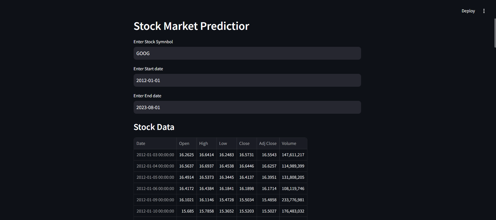
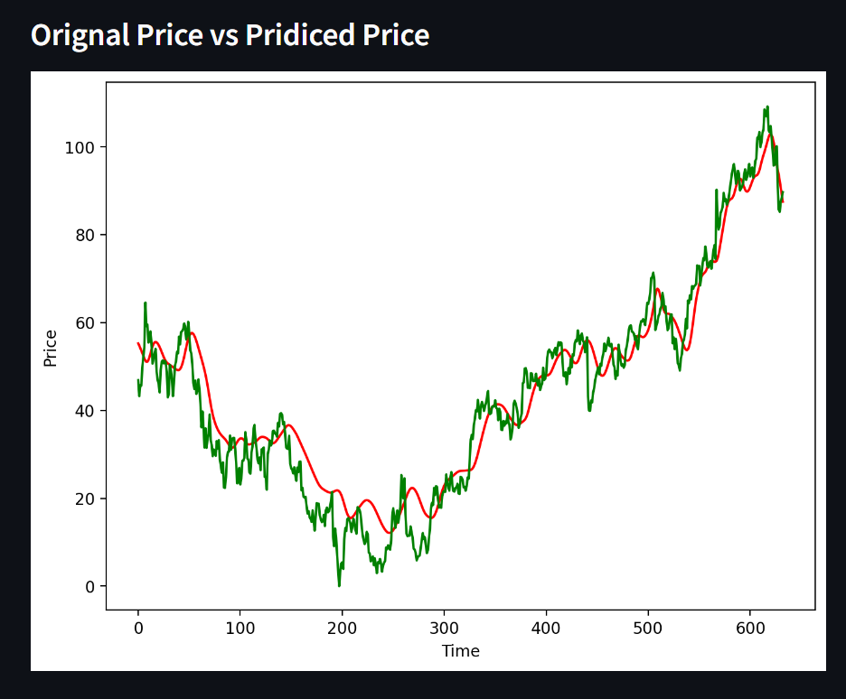

# Stock Price Prediction Model

Welcome to the Stock Price Prediction Model repository! This project aims to predict stock prices using historical data and machine learning techniques. The model is hosted on Streamlit for easy interaction.
To visit my project click this link -> https://kushxkalsi-stock-price-prediction-model-app-qsl2cv.streamlit.app/

## Overview

This project utilizes various Python libraries to build a robust stock price prediction model. The model is trained on historical stock data fetched from Yahoo Finance, and predictions are made using a deep learning model. The user interface is created using Streamlit, allowing users to interact with the model seamlessly.

## Features

- Fetch historical stock data using `yfinance`.
- Preprocess data using `numpy` and `pandas`.
- Build and train deep learning models with `TensorFlow` and `Keras`.
- Visualize data and predictions with `matplotlib`.
- Deploy the model with an interactive Streamlit app.

## Libraries Used

- **NumPy**: Efficient numerical computations.
- **Pandas**: Data manipulation and analysis.
- **yFinance**: Fetching historical stock data.
- **TensorFlow & Keras**: Building and training deep learning models.
- **Streamlit**: Hosting the model on a web app.
- **Matplotlib**: Data visualization.
